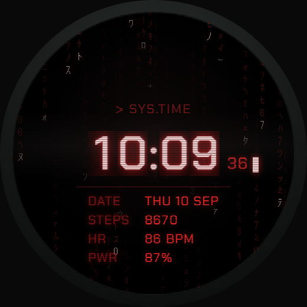
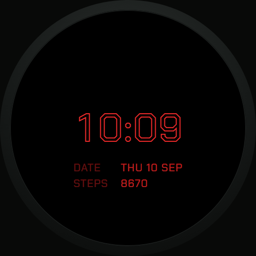
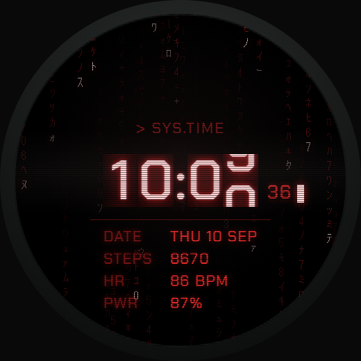

# Matrix Watchface Red

Watchface for the Amazfit T-Rex 3 Pro 48 mm (Zepp OS, 480 × 480 px, round).
Red Matrix rain as the background, time and sensor values in a terminal
layout.

Red variant of `matrix-watchface`. The differences are limited to the colour
palette in `watchface/index.js`, the red-rendered rain frames, and `appId` and
`appName` in `app.json`.



## Features

- **Rain background** built from 24 pre-rendered PNG frames (480 × 480) at
  6 fps, 4 s loop, seamlessly closed
- **Time** centred at 80 px, seconds beside it at 28 px, cursor blinking once
  per second
- **Data rows** for date, steps, heart rate and battery, with labels and values
  on fixed X positions
- **AOD** on its own widget level (`show_level.ONAL_AOD`): dimmed colours, time,
  date and steps only, no animation
- **Chakra Petch Medium** as the typeface, shipped with the package



## Update strategy

A widget is only written when its value has actually changed.

| Trigger | Updates |
| --- | --- |
| `Time.onPerMinute()` | hour, minute, date, battery, AOD level |
| `Step.onChange()`, `HeartRate.onLastChange()` | steps, heart rate – buffered, written at most once per second |
| `setInterval(1000)` | seconds and cursor, only while the screen is on |

## Requirements

- Amazfit T-Rex 3 Pro 48 mm, paired with the Zepp app
- [Node.js](https://nodejs.org/) 14 or newer
- A Zepp account and developer mode enabled in the Zepp app
  (Profile → paired device → scroll to the bottom)

## Installation

The watchface is not in the Zepp store; it is installed through developer mode.

```bash
npm install -g @zeppos/zeus-cli
zeus login
git clone https://github.com/<account>/matrix-watchface-red.git
cd matrix-watchface-red
zeus preview
```

`zeus preview` builds the package and prints a QR code in the terminal. Scan it
with the scan function in the Zepp app's developer mode; the watchface is
transferred to the watch and shows up in the watchface picker.

`zeus build` produces a `.zab` package under `dist/` instead.

The green and the red variant use different `appId`s and can be installed side
by side on the same watch.

## Configuration

Feature flags at the top of `watchface/index.js`:

| Flag | Default | Effect |
| --- | --- | --- |
| `USE_RAIN` | `true` | rain animation from `image/rain/` |
| `USE_FLAP` | `false` | split-flap animation on digit change |

The split-flap animation is fully implemented and its frames live under
`image/flap/` (6 frames for the large digits, 4 each for seconds and small
digits, 20 fps, so 300 ms per digit step). A jump from 9 to 2 plays 9→0, 0→1
and 1→2 back to back. It does not run cleanly on real hardware yet, so the flag
is off and digits change directly.



## Colour palette

Defined as `COLOR` in `watchface/index.js`:

| Key | Value | Used for |
| --- | --- | --- |
| `digit` | `0xffd9d9` | large digits |
| `second` | `0xbf2222` | seconds |
| `label` | `0x731414` | data row labels |
| `value` | `0xf22b2b` | data row values |
| `rule` | `0x4d0e0e` | separator line |
| `aodLabel` | `0x611111` | labels in AOD |
| `aodValue` | `0xb82020` | values in AOD |

## Project layout

```
app.json                    manifest: target, appId, permissions
app.js                      app entry point
watchface/index.js          layout, widgets, sensor wiring
assets/480x480-.../image/   rain (24), flap, digit
assets/480x480-.../fonts/   Chakra Petch Medium + OFL.txt
design/                     HTML artboards of the layout draft
docs/screenshots/           screenshots used in this README
```

## Compatibility

Targeted at the T-Rex 3 Pro 48 mm at 480 × 480 px. Other round Zepp OS devices
with the same resolution – the T-Rex 3 or T-Rex Ultra 2, for example – can be
added with one more entry under `targets` in `app.json`. The 44 mm variant is
466 × 466 px and needs a layout of its own.

## Licence

Chakra Petch is licensed under the SIL Open Font License. The licence file sits
next to the font as `OFL.txt` and has to be shipped with it.

## Status

Working. Open points are the split-flap animation (see above) and a dedicated
`appId` from the Zepp developer console, as long as a store release is planned.
Details in [DEVELOPMENT.md](DEVELOPMENT.md).

Green variant: `matrix-watchface`.
